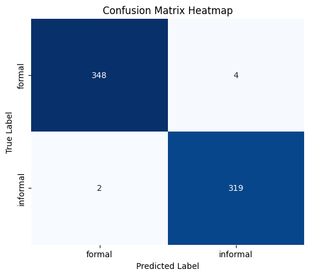
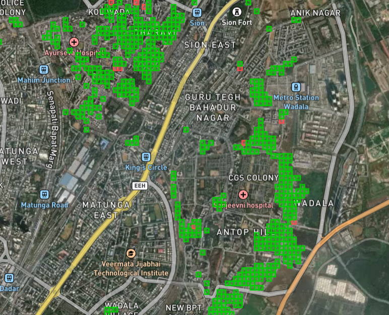

# Informal Settlement Detection

This directory contains the code to prepare the labelled training data set and to train a model to distinguish formal and informal neighborhoods in urban context.

## Training Data

This model is created and trained to distinguish formal and informal *50x50m large urban tiles*. The tiles are described by the following five attributes:
- Count of buildings in the tile
- Average height of buildings inside the tile
- Average area of buildings inside the tile
- The area of the largest building inside the tile
- Amount of tree coverage inside the tile

Building count and footprint area sizes are obtained from [Open Buildings Insights](https://obi.sdg7energyplanning.org/), deriving the information from the [VIDA managed building footprint catalog](https://source.coop/repositories/vida/google-microsoft-open-buildings/description) as described in its documentation.

Building height information is obtained from [Open Buildings Insights](https://obi.sdg7energyplanning.org/), deriving the information from [Open Buildings 2.5D](https://sites.research.google/gr/open-buildings/temporal/) dataset as described in its documentation.

Amount of tree coverage is obtained from [High Resolution Canopy Height Maps](https://registry.opendata.aws/dataforgood-fb-forests/) by WRI and Meta as a number of pixels inside the tile with a vegetation height not less than three meters.

To train the model a substantial amount of tiles must be identified as formal and informal for the training and validation purposes. To obtain infromal tiles the publicly available [Shelter Associates](https://app.shelter-associates.org/) was used, which organization surveys infromal settlements inside the State of Maharashtra and provides informal settlement boundaries. These boundaries are used to create the informal settlement part of the labelled data set. Some informal settlement boundaries expand to forests. Due to use of satellite data, which can not penetrate dense canopy these parts of the informal settlements appear empty and as such as unusable for the model training, therefore such areas are ignored. The rest of the shapes are sliced into the 50x50m tiles based on their inner grid.

To create a similar amount of urban formal settlement tiles several urban parts of Navi Mumbai, Pune and Thane are selected, which were not mapped by Shelter Associates as informal. These parts of the cities are divided into 50x50m tiles and server as the formal settlement part of the labelled data set.

## Model Training

The following model architecture was created:

| Layer (type)                    | Output Shape           |       Param # |
| --- | --- | --- |
| dense_0 (Dense)                 | (None, 24)             |           144 |
| dense_1 (Dense)                 | (None, 88)             |         2,200 |
| output (Dense)                  | (None, 1)              |            89 |

It was trained using 50 epochs, using Adam's optimizer.

## Model Validation

The model was verified on part of the labelled data never used for training, creating the following confusion matrix:
<figure>
  
  <figcaption>Figure 1: Confusion matrix for the informal settlement model</a></figcaption>
</figure>

The model was also tested on cities, which were not used during the training, e.g., in Mumbai. The following snippet showcases the result of the model in the city:
<figure>
  
  <figcaption>Figure 1: Confusion matrix for the informal settlement model</a></figcaption>
</figure>

## Libraries

The list of most important libraries is provided:

| Package Name | Version | Short Description |
| --- | --- | --- |
| jaydebeapi | 1.2.3 | Use JDBC database drivers from Python 2/3 or Jython with a DB-API. |
| jpype | 1.5.2 | A Python to Java bridge. |
| json | default | A library to work with JSON documents. |
| geopandas | 1.0.1 | Geographic pandas extensions |
| pandas | 2.1.3 | Powerful data structures for data analysis, time series, and statistics |
| pyproj | 3.6.1 | Python interface to PROJ (cartographic projections and coordinate transformations library) |
| shapely | 2.0.6 | Manipulation and analysis of geometric objects |
| numpy | 1.23.5 | Fundamental package for array computing in Python |
| ibm_boto3 | 1.35 | The IBM SDK for Python |
| botocore | 1.35 | Low-level, data-driven core of boto 3. |
| ibm_cloud_sdk_core | 2.13.6 | Core library used by SDKs for IBM Cloud Services |
| rasterio | 1.4.3 | Fast and direct raster I/O for use with Numpy and SciPy |
| scikit-learn | 1.6.1 | A machine learning library for Python |
| tensorflow & keras | 2.19 | An end-to-end open source machine learning platform |

## Execution

To execute the training process the following notebooks are executed in order:

1.	0.1_download_forest_tiles.ipynb
2.	1.0 preparation_of_dataset.ipynb
3.	2.0. training_to_parquet.ipynb
4.	3.0. NN_withTrees.ipynb
